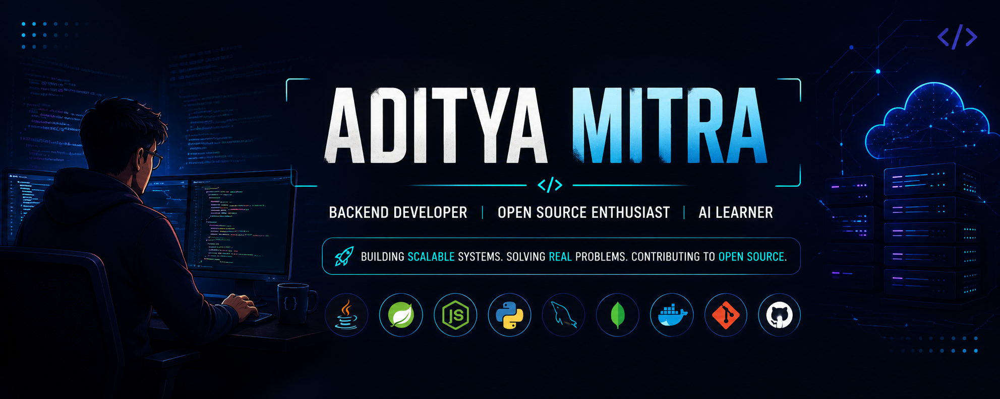

<!-- ===================================================== -->
<!--                  HERO SECTION v3                      -->
<!-- ===================================================== -->

<p align="center">



</p>

<p align="center">


</p>

<p align="center">

<a href="https://github.com/Aditya70-creator">

</a>

<a href="https://www.linkedin.com/in/aditya-mitra-708913380">

</a>

<a href="mailto:mitraaditya14@gmail.com">

</a>

</p>

<p align="center">


</p>

---

# 👋 About Me

```java
public class AdityaMitra {
    private final String role = "Backend Developer";
    private final String education = "B.Tech Computer Science Engineering";
    private final String[] focus = {
        "Java",
        "Spring Boot",
        "Backend Development",
        "Open Source",
        "System Design"
    };
    private final String[] currentlyLearning = {
        "Spring Boot",
        "Apache Open Source",
        "Data Structures & Algorithms",
        "Distributed Systems"
    };
    public void buildCareer() {
        while(true){
            learn();
            build();
            contribute();
            improve();
        }
    }
}
```

---

<table>

<tr>

<td width="33%" valign="top">

[](https://gitfut.com/Aditya70-creator)

</td>

<td width="33%" valign="top">

## 🚀 Current Focus

• Backend Development

• Spring Boot

• Apache Open Source

• Git & GitHub

• LeetCode

• Clean Architecture

• REST APIs

</td>

<td width="33%" valign="top">

## 🎯 2026 Goals

⭐ Apache Contributor

⭐ 250+ LeetCode Problems

⭐ Production Ready Projects

⭐ Strong Java Backend Skills

⭐ GSoC 2027 Preparation

</td>

</tr>

</table>

---

<p align="center">


</p>

<!-- ===================================================== -->
<!--                  TECH STACK v3                        -->
<!-- ===================================================== -->

# 🛠️ Tech Stack

<div align="center">

### 💻 Languages


### ⚙️ Backend Development


### 🗄️ Databases


### ☁️ DevOps & Tools


### 📚 Currently Learning


</div>

---

<!-- ===================================================== -->
<!--                GITHUB ANALYTICS v3                    -->
<!-- ===================================================== -->

# 📊 GitHub Analytics

<div align="center">


</div>

<br>

<div align="center">


</div>

---

# 📈 Contribution Activity

<div align="center">


</div>

---

# 📦 GitHub Summary Cards

<div align="center">


<br><br>


</div>

---

# 🐍 Contribution Snake

<div align="center">

<picture>

<source media="(prefers-color-scheme: dark)"
srcset="https://raw.githubusercontent.com/Aditya70-creator/Aditya70-creator/output/github-contribution-grid-snake-dark.svg"/>

<source media="(prefers-color-scheme: light)"
srcset="https://raw.githubusercontent.com/Aditya70-creator/Aditya70-creator/output/github-contribution-grid-snake.svg"/>


</picture>

</div>

---

<!-- ===================================================== -->
<!--                 FEATURED PROJECTS v3                  -->
<!-- ===================================================== -->

# 🚀 Featured Projects

<table>

<tr>

<td width="50%" valign="top">

## 🧠 MemoryDock


A modern cloud-inspired file management platform focused on secure storage, synchronization, sharing and productivity.

### ✨ Highlights

- Secure File Storage
- Cross Device Synchronization
- User Authentication
- File Sharing
- Clean Dashboard

### ⚙️ Tech Stack


<br><br>

<a href="https://github.com/Aditya70-creator/Memory_Dock">

</a>

</td>

<td width="50%" valign="top">

## 📊 Student Marks Manager


A web application designed to manage student records, calculate CGPA and visualize academic performance.

### ✨ Highlights

- Student Management
- CGPA Calculator
- Dashboard
- Result Analysis
- Clean UI

### ⚙️ Tech Stack


<br><br>

<a href="https://github.com/Aditya70-creator/Student-Marks-Manager">

</a>

</td>

</tr>

<tr>

<td width="50%" valign="top">

## 💻 LeetCode Solutions


A continuously growing collection of optimized Data Structures & Algorithms solutions with clean code.

### 📚 Covers

- Arrays
- Strings
- Linked List
- Trees
- Graphs
- Dynamic Programming

### ⚙️ Tech


<br><br>

<a href="https://github.com/Aditya70-creator/leetcode-solutions">

</a>

</td>

<td width="50%" valign="top">

## 🌍 Apache Open Source


Preparing to contribute to Apache projects by understanding enterprise-level codebases and open-source workflows.

### 🎯 Current Goals

- Apache Grails
- Bug Fixes
- Documentation
- Issue Discussions
- Pull Requests

### ⚙️ Focus


<br><br>


</td>

</tr>

</table>

---

# ⚡ Core Interests

<div align="center">

| 💻 Backend | 🌍 Open Source | 📚 Learning | 🚀 Career |
|------------|----------------|-------------|------------|
| REST APIs | Apache | Java | Software Engineering |
| Spring Boot | GitHub | DSA | Backend Development |
| Databases | Collaboration | System Design | GSoC 2027 |
| Microservices | Code Reviews | Linux | Production Systems |

</div>

---

<p align="center">


</p>

<!-- ===================================================== -->
<!--                 CONNECT SECTION v3                    -->
<!-- ===================================================== -->

# 📈 2026 Progress

<div align="center">

| Goal | Progress |
|------|:-------:|
| Java Backend | 🟩🟩🟩🟩⬜ |
| Spring Boot | 🟩🟩🟩⬜⬜ |
| Data Structures | 🟩🟩🟩🟩⬜ |
| Open Source | 🟩⬜⬜⬜⬜ |
| System Design | 🟩⬜⬜⬜⬜ |

</div>

---

# ⚡ Beyond Coding

<div align="center">

🎵 Music while coding

☕ Coffee-powered debugging

📚 Always learning

🌍 Open Source believer

🚀 Building software that solves real problems

</div>

---

# 📬 Thanks for Visiting

<div align="center">

⭐ If you like my work, consider starring a repository.

I'm always open to learning, collaborating, and building meaningful software.

### Happy Coding! 🚀

</div>

---

<div align="center">


</div>
